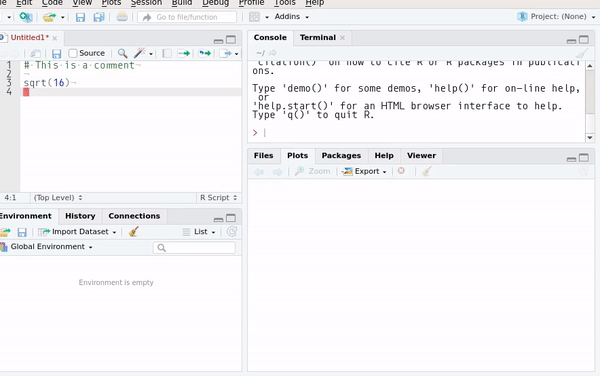

# Preface {-}

```{r, include=FALSE}
library(tidyverse)
library(broom)
library(ggthemes)
library(janitor)
```

## What is R? {-}

Read R's official answer to this question
[here](https://cran.r-project.org/doc/FAQ/R-FAQ.html#What-is-R_003f). To make it short: R is
multi-paradigm (procedural, imperative, object-oriented and functional) ^[In this book we are going
to focus on R's functional programming capabilities] programming language that
focuses on applications in *statistics*. By *statistics* I mean any field that uses statistics such
as official statistics, economics, finance, data science, etc.

## Why *modern* R? {-}

*Modern* R instead of just R because we are going to learn how to use modern packages and concepts,
such as functional programming (which is quite an old concept actually, but one that came into
fashion recently). R is derived from S, which is a programming language that has roots in FORTRAN
and Scheme. If you learned R at university, you've probably learned to use it as you would have
used FORTRAN; very long scripts where data are represented as matrices and where row-wise
(or column-wise) operations are implemented with `for` loops. There's nothing wrong with that, mind
you, but it is a shame not to use R's functional programming capabilities that it inherited from
Scheme, because I believe that it makes writing code easier and more natural. At its core, functional
programming uses functions, and functions are first class objects in R. We are going to learn what
that means later. First, we are going to use functions that are already available in R, and then
use those available in packages, mostly those from the `tidyverse`. The `tidyverse` is a collection
of packages developed by [Hadley Wickham](http://hadley.nz/). By using the packages from the
`tidyverse` and R's built-in functional programming capabilities, we can write code that is faster
and easier to explain to colleagues, and also easier to maintain. This also means that you might
have to change your expectations and what you know already from R, if you learned it at University
but haven't touched it in a long time.

## What is Rstudio? {-}

Rstudio is a modern IDE that makes writing R code easier. The first thing we are going to learn is
how to use it.
R and Rstudio are both open source: this means that the source code is freely available on the internet
and contributions by anyone are welcome and integrated; provided they are meaningful and useful.

## Prerequisites {-}

R and Rstudio are the two main pieces of software that we are going to use. Both are already installed
on your desktop computer. R is the programming language and Rstudio is a modern IDE for it. You can
use R without Rstudio; but you cannot use Rstudio without R.

If you wish to install R and Rstudio at home to follow the examples in this book you can do it as
both pieces of software are available free of charge (for firms paid options for Rstudio exist).
Installation is simple, but operating system dependent. To download and install R for Windows,
follow [this link](https://cloud.r-project.org/bin/windows/base/).
For macOS, follow [this one](https://cloud.r-project.org/bin/macosx/). If you run a GNU+Linux
distribution, you can install R using the system's package manager. On Ubuntu, install `r-base`.

For Rstudio, look for your operating system [here](https://www.rstudio.com/products/rstudio/download/#download).

## What are packages? {-}

There is one more step; we are going to install some packages. Packages are additional pieces of
code that can be installed from within R with the following function: `install.packages()`. These
packages extend R's capabilities significantly, and are probably one of the main reasons R is so
popular. As of October 2017, R has over 11000 packages.

To install the packages we need, first open Rstudio and then copy and paste this line in the console:

```{r, eval=FALSE}
install.packages(c("tidyverse", "checkpoint", "Ecdat", "ggthemes", "janitor", "rio", "colourpicker"))
```

```{r, echo=FALSE}
knitr::include_graphics("pics/install_packages.png")
```

or go to the **Packages** pane and then click on *Install*:

```{r, echo=FALSE}
knitr::include_graphics("pics/rstudio_install_packages.gif")
```

### The author {-}

My name is Bruno Rodrigues and I work in the research department of STATEC. I program almost
exclusively in R and have been teaching some R courses for a few years now (first started teaching
for students at the Université of Strasbourg). These notes are an update of those I used at the
time, plus a lot of things I've learned about R since I started working at STATEC. I also am writing
another [book](https://b-rodrigues.github.io/fput/) that is more advanced than this one. In my free
time I like cooking, boxing and [blogging](https://www.brodrigues.co). You can follow me
on [twitter](https://www.twitter.com/brodriguesco) if you'd like!

<!--chapter:end:index.Rmd-->

# Getting to know Rstudio


## Panes

Rstudio is divided into different panes. Each pane has a specific function. The gif below shows
some of these panes:

```{r, echo=FALSE}
knitr::include_graphics("pics/rstudio_panes.gif")
```

Take some time to look around what each pane shows you. Some panes are empty; for example the *Plots*
pane or the *Viewer* pane. *Plots* shows you the plots you make. You can browse the plots and save
them. We will see this in more detail in a later chapter. *Viewer* shows you previews of documents
that you generate with R. More on this later.

## Console

The *Console* pane is where you can execute R code. Write the following in the console:

```{r, eval=FALSE}
2 + 3
```

and you'll get the answer, `5`. However, do not write a lot of lines in the console. It is better
write your code inside a script.

## Scripts

Look at the gif below:

```{r, echo=FALSE}
knitr::include_graphics("pics/rstudio_new_script.gif")
```

In this gif, we see the user creating a new R script. R scripts are simple text files that hold R
code. Think of `.do` files in STATA or `.c` files for C. R scripts have the extension `.r` or `.R`.

It is possible to create a lot of other files. We'll take a look at `R Markdown` files later.

### The help pane

The *Help* pane allows you to consult documentation for functions or packages. The gif below shows
how it works:

```{r, echo=FALSE}
knitr::include_graphics("pics/rstudio_help.gif")
```

you can also access help using the following syntax: `?lm`. This will bring up the documentation for
the function `lm()`. You can also type `??lm` which will look for the string `lm` in every package.

### The Environment pane

The *Environment* pane shows every object created in the current section. It is especially useful
if you have defined lists or have loaded data into R as it makes it easy to explore these more
complex objects.

## Options

It is also possible to customize Rstudio's look and feel:

```{r, echo=FALSE}
knitr::include_graphics("pics/rstudio_options.gif")
```

Take some time to go through the options.

## Keyboard shortcuts

It is a good idea to familiarize yourself with at least some keyboard shortcuts. This is more
convenient than having to move the mouse around:

```{r, echo=FALSE}
knitr::include_graphics("pics/rstudio_shortcuts.gif")
```

If there is only one keyboard shortcut you need to know, it's `Ctrl-Enter` that executes a line of code
from your script. However, these other shortcuts are also worth knowing:

* `CTRL-ALT-R`: run entire script
* `CTRL-ALT-UP or DOWN`: make cursor taller or shorter, allowing you to edit multiple lines at the same time
* `CTRL-F`: Search and replace
* `ALT-UP or DOWN`: Move line up or down
* `CTRL-SHIFT-C`: Comment/uncomment line
* `ALT-SHIFT-K`: Bring up the list of keyboard shortcuts
* `CTRL-SHIFT-M`: Insert the pipe operator (`%>%`, more on this later)
* `CTRL-S`: Save script

This is just a few keyboard shortcuts that I personally find useful. However, I strongly advise you
to learn and use whatever shortcuts are useful to you!

## Projects

One of the best features of Rstudio are projects. Creating a project is simple; the gif below
shows how you can create a project and how you can switch between projects.

```{r, echo=FALSE}

```

Projects make a lot of things easier, such as managing paths. More on this in the chapter about
reading data. Another useful feature of projects is that the scripts you open in project A will
stay open even if you switch to another project B, and then switch back to the project A again.

You can also use version control (with git) inside a project. Version control is very useful, but
I won't discuss it here. You can find a lot of resources online to get you started with git.

## History

The history pane saves all the previous lines you executed. You can then select these lines and
send them back to the console or the script.

```{r, echo=FALSE}
knitr::include_graphics("pics/rstudio_history.gif")
```

## Plots

All the plots you make during a session are visible in the *Plots* pane. From there, you can
export them in different formats.

```{r, echo=FALSE}
knitr::include_graphics("pics/rstudio_plots.gif")
```

The plots shown in the gif are made using basic R functions. Later, we will learn how to make nicer
looking plots using the package `ggplot2`.

<!--chapter:end:01-rstudio.Rmd-->

# Packages

You can think of packages as addons that extend R's core functionality. You can browse all available
packages on [CRAN](https://cloud.r-project.org/). To make it easier to find what you might be
interested in, you can also browse the [CRAN Task Views](https://cloud.r-project.org/web/views/).
Each package has a landing page that summarises its dependencies, version number etc. For example,
for the `dplyr` package: [https://cran.r-project.org/web/packages/dplyr/index.html](https://cran.r-project.org/web/packages/dplyr/index.html).
Take a look at the *Downloads* section, and especially at the Reference Manual and Vignettes:

```{r, echo=FALSE}
knitr::include_graphics("pics/packages_vignette.png")
```

Vignettes are valuable documents; inside vignettes, the purpose of the package is explained in
plain English, usually with accompanying examples. The reference manuals list the available functions
inside the packages. You can also find vignettes from within Rstudio:


```{r, echo=FALSE}
knitr::include_graphics("pics/rstudio_vignette.gif")
```

Go to the *Packages* pane and click on the package you're interested in. Then you can consult the
help for the functions that come with the package as well as the package's vignettes.

Once you installed a package, you have to load it before you can use it. To load packages you use the
`library()` function:

```{r, eval=FALSE}
library(dplyr)
library(janitor)
# and so on...
```

If you only need to use one single function once, you don't need to load an entire package. You can
write the following:

```{r, eval=FALSE}
dplyr::full_join(A, B)
```

using the `::` operator, you can access functions from packages without having to load the whole
package beforehand.

It is possible and easy to create your own packages. This is useful if you have to write a lot of
functions that you use daily. This is outside the scope of this book, but if you're interested
you can read this [other one](https://b-rodrigues.github.io/fput/packages.html) I wrote.

<!--chapter:end:02-packages.Rmd-->

# Data types and objects

R use a variety of data types. You already know most of them, actually!
Integers (\emph{nombres entiers}), floating point numbers, or floats (\emph{nombres réels}),
matrices, etc, are all objects you already use on a daily basis.
But R has a lot of other data types (that you can find in a lot of other programming languages)
that you need to become familiar with.

But first, we need to learn how to assign a variable. This can be done in two ways:

```{r, cache=TRUE}
a <- 3
```

or

```{r, cache=TRUE}
a = 3
```

there is almost no difference between these two approaches. You would need to pay attention to
this, and use `<-` in very specific situations to which you will very likely never be confronted
to.

Another thing you must know is that you can convert from one type to another using
`as.character()`, `as.numeric()`, `as.logical()`, etc... For example, `as.character(1)` converts
the number `1` to the character (or string) "1". There are also `is.character()`, `is.numeric()`
and so on that test if the object is of the required class. These functions exist for each object
type, and are very useful. Make sure you remember them!

## The `numeric` class

To define single numbers, you can do the following:

```{r, cache=TRUE}
a = 3
```

The `class()` function allows you to check the class of an object:

```{r, cache=TRUE}
class(a)
```

Decimals are defined with the character `.}:

```{r, cache=TRUE}
a = 3.14
```

## The `character` class

Use `" "` to define characters (called strings in other programming languages):

```{r, cache=TRUE}
a = "this is a string"
```

```{r, cache=TRUE}
class(a)
```

## Vectors and matrices

You can create a vector in different ways. But first of all, it is important to understand that a
vector in most programming languages is nothing more than a list of things. These things can be
numbers (either integers or floats), strings, or even other vectors. The same applies for matrices.

### The `c()` function

A very important function that allows you to build a vector is `c()`:

```{r, cache=TRUE}
a = c(1,2,3,4,5)
```

This creates a vector with elements 1, 2, 3, 4, 5. If you check its class:

```{r, cache=TRUE}
class(a)
```

This can be confusing: you where probably expecting a to be of class \emph{vector, cache=TRUE} or
something similar. This is not the case if you use `c()` to create the vector, because `c()`
doesn't build a vector in the mathematical sense, but rather a list with numbers.
Checking its dimension:

```{r, cache=TRUE}
dim(a)
```

A list doesn't have a dimension, that's why the `dim()` command returns `NULL`. If you want to
create a true vector, you need to use `cbind()` or `rbind()`.

### `cbind()` and `rbind()`

You can create a *true* vector with `cbind()`:

```{r, cache=TRUE}
a = cbind(1,2,3,4,5)
```

Check its class now:

```{r, cache=TRUE}
class(a)
```

This is exactly what we expected. Let's check its dimension:

```{r, cache=TRUE}
dim(a)
```

This returns the dimension of `a` using the LICO notation (number of LInes first, the number of COlumns).

It is also possible to bind vectors together to create a matrix.

```{r, cache=TRUE}
b = cbind(6,7,8,9,10)
```

Now let's put vector `a` and `b` into a matrix called `matrix_c` using `rbind()`.
`rbind()` functions the same way as `cbind()` but glues the vectors together by rows and not by columns.

```{r, cache=TRUE}
matrix_c = rbind(a,b)
print(matrix_c)
```

### The `matrix` class

R also has support for matrices. For example, you can create a matrix of dimension (5,5) filled
with 0's with the `matrix()` function:

```{r, cache=TRUE}
matrix_a = matrix(0, nrow = 5, ncol = 5)
```

If you want to create the following matrix:

\[
B = \left(
\begin{array}{ccc}
 2 & 4 & 3 \\
 1 & 5 & 7
\end{array} \right)
\]

you would do it like this:

```{r, cache=TRUE}
B = matrix(c(2, 4, 3, 1, 5, 7), nrow = 2, byrow = TRUE)
```

The option `byrow = TRUE` means that the rows of the matrix will be filled first.

You can access individual elements of `matrix_a` like so:


```{r, cache=TRUE}
matrix_a[2, 3]
```

and R returns its value, 0. We can assign a new value to this element if we want. Try:

```{r, cache=TRUE}
matrix_a[2, 3] = 7
```

and now take a look at `matrix_a` again.

```{r, cache=TRUE}
print(matrix_a)
```

Recall our vector `b`:

```{r, cache=TRUE}
b = cbind(6,7,8,9,10)
```

To access its third element, you can simply write:

```{r, cache=TRUE}
b[3]
```

## The `logical` class

This class is the result of logical comparisons, for example, if you type:

```{r, cache=TRUE}
4 > 3
```

R returns true. If we save this in a variable `l`:

```{r, cache=TRUE}
l = 4 > 3
```

and check `l`'s class:

```{r, cache=TRUE}
class(l)
```

R returns `logical`. In other programming languages, `logical`s are often called `bool`s.

A `logical` variable can only have two values, either `TRUE` or `FALSE`.


## The `list` class

The `list` class is a very flexible class, and thus, very useful. You can put anything inside a list,
such as numbers:

```{r, cache=TRUE}
list1 = list(3, 2)
```

or vectors:

```{r, cache=TRUE}
list2 = list(c(1, 2), c(3, 4))
```

you can also put objects of different classes in the same list:

```{r, cache=TRUE}
list3 = list(3, c(1, 2), "lists are amazing!")
```

and of course create list of lists:

```{r, cache=TRUE}
my_lists = list(list1, list2, list3)
```

To check the contents of a list, you can use the structure function `str()`:

```{r, cache=TRUE}
str(my_lists)
```

or you can use Rstudio's *Environment* pane:

```{r, echo=FALSE}
knitr::include_graphics("pics/rstudio_environment_list.gif")
```

You can also create named lists:

```{r, cache=TRUE}
list4 = list("a" = 2, "b" = 8, "c" = "this is a named list")
```

and you can access the elements in two ways:

```{r, cache=TRUE}
list4[[1]]
```

or, for named lists:

```{r, cache=TRUE}
list4$c
```

Lists are used extensively because they are so flexible. You can build lists of datasets and apply
functions to all the datasets at once, build lists of models, lists of plots, etc... In the later
chapters we are going to learn all about them.

## The `data.frame` and `tibble` classes

In the next chapter we are going to learn how to import datasets into R. Once you import data, the
resulting object is either a `data.frame` or a `tibble` depending on which package you used to
import the data. `tibble`s extend `data.frame`s so if you know about `data.frame` objects already,
working with `tibble`s will be very easy. `tibble`s have a better `print()` method, and some other
niceties. If you want to know more, I go into more detail in my [other
book](https://b-rodrigues.github.io/fput/tidyverse.html#getting-data-into-r-with-readr-readxl-haven-and-what-are-tibbles)
but for our purposes, there's not much you need to know about `data.frame` and `tibble` objects,
apart that this is the representation of a dataset when loaded into R.

However, I want to stress that these objects are central to R and are thus very important. There
are different ways to print a `data.frame` or a `tibble` if you wish to inspect it. You can use
`View(my_data)` to show the `my_data` `data.frame` in the *View* pane of RStudio:

```{r, echo=FALSE}
knitr::include_graphics("pics/rstudio_view_data.gif")
```

You can also use the `str()` function:

```{r, eval=FALSE}
str(my_data)
```

And if you need to access an individual column, you can use the `$` sign, same as for a list:

```{r, eval=FALSE}
my_data$col1
```

## Formulas

We will learn more about formulas later, but because it is an important object, it is useful if you
already know about them early on. A formula is defined in the following way:

```{r, cache=TRUE}
my_formula = ~x

class(my_formula)
```

Formula objects are defined using the `~` symbol. Formulas are useful to define statistical models,
for example for a linear regression:

```{r, eval=FALSE}
lm(y ~ x)
```

or also to define anonymous functions, but more on this later.


## Exercises

### Exercise 1 {-}

Try to create the following vector:

\[a = (6,3,8,9)\]

and add it this other vector:

\[b = (9,1,3,5)\]

and save the result to a new variable called `result`.

### Exercise 2

Using `a` and `b` from before, try to get their dot product.

Try with `a * b` in the R console. What happened?
Try to find the right function to get the dot product. Don't hesitate to google the answer!

### Exercise 3

How can you create a matrix of dimension (30,30) filled with 2's by only using the function `matrix()`?

### Exercise 4

Save your first name in a variable `a` and your surname in a variable `b`. What does the function:

```{r, eval = FALSE}
paste(a,b)
```

do? Look at the help for `paste()` with `?paste` or using the *Help* pane in Rstudio. What does the
optional argument `sep` do?

### Exercise 5

Define the following variables: `a = 8`, `b = 3`, `c = 19`. What do the following lines check?
What do they return?

```{r, eval=FALSE}
a > b
a == b
a != b
a < b
(a > b) && (a < c)
(a > b) && (a > c)
(a > b) || (a < b)
```

### Exercise 6

Define the following matrix:

\[
\text{matrix_a} = \left(
\begin{array}{ccc}
 9 & 4 & 12 \\
 5 & 0 & 7 \\
 2 & 6 & 8 \\
 9 & 2 & 9
\end{array} \right)
\]

```{r, include=FALSE}
matrix_a = matrix( c(9, 4, 12, 5, 0, 7, 2, 6, 8, 9, 2, 9), nrow = 4, byrow = TRUE)
```

* What does `matrix_a >= 5` do?
* What does `matrix_a[ , 2]` do?
* Can you find which function gives you the transpose of this matrix?

### Exercise 7

Solve the following system of equations using the `solve()` function:

\[
\left(
\begin{array}{cccc}
 9 & 4 & 12 & 2 \\
 5 & 0 & 7 & 9\\
 2 & 6 & 8 & 0\\
 9 & 2 & 9 & 11
\end{array} \right) \times \left(
\begin{array}{ccc}
 x \\
 y \\
 z \\
 t \\
\end{array}\right) =
\left(
\begin{array}{ccc}
7\\
18\\
1\\
0
\end{array}
\right)
\]


```{r, include=FALSE}
matrix_a = matrix( c(9, 4, 12, 5, 0, 7, 2, 6, 8, 9, 2, 9), nrow = 4, byrow = TRUE)

matrix_x = cbind(matrix_a, c(2,9,0,11))

result = c(7, 8, 1, 0)

solution = solve(matrix_x, result)
```

<!--chapter:end:03-data_types.Rmd-->

# Reading and writing data

In this chapter, we are going to import example datasets that are available in R, `mtcars` and
`iris`. I have converted these datasets into several formats. Download those datasets
[here](https://github.com/b-rodrigues/r_for_statec/tree/master/datasets) if you want to follow the
examples below. R can import some formats without the need of external packages, such as the `.csv`
format. However, for other formats, you will need to use different packages. Because there are a
lot of different formats available I suggest you use `rio`. `rio` is basically a wrapper around a
lot of packages that exist to import/export data. This package is nice because you don't need to
remember which package to use to import, say, STATA datasets and then you need to remember which
one for SAS datasets, and so on. Read `rio`'s
[vignette](https://cran.r-project.org/web/packages/rio/vignettes/rio.html) for more details. Below
I show some of `rio`'s functions presented in the vignette. It is also possible to import data from
other, less "traditional" sources, such as your clipboard.


## The swiss army knife of data import and export: `rio`

To import data with `rio`, `import()` is all you need:

```{r}
library(rio)

mtcars = import("datasets/mtcars.csv")
```

```{r}
head(mtcars)
```

`import()` needs the path to the data, and you can specify additional options if needed. On a
Windows computer, you have to be careful to the path; you cannot simply copy and paste it, because
paths in Windows use the `\` symbol whereas R uses `/` (just like on Linux or macOS).
Importing a STATA or a SAS file is done just the same:

```{r}
mtcars_stata = import("datasets/mtcars.dta")
head(mtcars_stata)

mtcars_sas = import("datasets/mtcars.sas7bdat")
head(mtcars_sas)
```

It is also possible to import Excel files where each sheet is a single table, but you will need
`import_list()` for that. The file `multi.xlsx` has two sheets, each with a table in it:

```{r}
multi = import_list("datasets/multi.xlsx")
str(multi)
```

As you can see `multi` is a list of datasets. Told you lists were very flexible! It is also possible
to import all the datasets in a single directory at once. For this, you first need a vector of paths:

```{r}
paths = Sys.glob("datasets/unemployment/*.csv")
```

`Sys.glob()` allows you to find files using a regular expression. "datasets/unemployment/*.csv"
matches all the `.csv` files inside "datasets/unemployment".

```{r}
all_data = import_list(paths)

str(all_data)
```

in a subsequent chapter we will learn how to actually use these lists of datasets.

If something goes wrong, you might need to take a look at the underlying function `rio` is
actually using to import the file. Let's look at the following example:

```{r}
testdata = import("datasets/problems/mtcars.csv")

head(testdata)
```

as you can see, the import didn't work quite well! This is because the separator is the `&` for
some reason. Because we are trying to read a `.csv` file, `rio::import()` is trying to use
`data.table::fread()` under the hood (you can read this in `imports()`'s help). If you go and read
`data.table::fread()`'s help, you see that the `fread()` has an optional `sep = ` argument that you
can use to specify the separator. You can use this argument in `import()` too, and it will be passed
down to `fread()`:

```{r}
testdata = import("datasets/problems/mtcars.csv", sep = "&")

head(testdata)
```

`export()` allows you to write data to disk, by simply providing the path and name of the file you
wish to save.

```{r, eval=FALSE}
export(testdata, "path/where/to/save/testdata.csv")
```

If you end the name with `.csv` the file is exported to the csv format, if instead you write `.dta`
the data will be exported to the STATA format, etc.

If you wish to export to Excel, this is possible, but requires that you change a file on your
computer (you only have to do this once). Run the following lines in Rstudio:

```{r, eval=FALSE}
if(!file.exists("~/.Rprofile")) # only create if not already there
    file.create("~/.Rprofile")    # (don't overwrite it)
file.edit("~/.Rprofile")
```
These lines, taken shamelessly from [Efficient R
programming](https://csgillespie.github.io/efficientR/3-3-r-startup.html#rprofile) (go read it,
it's a very great resource) look for and open the `.Rprofile` file which is a file that is run
every time you open Rstudio. This means that you can put any line of code there that will always be
executed whenever you launch Rstudio. The line you need to add is this:

```{r, eval=FALSE}
Sys.setenv("R_ZIPCMD" = "C:/Program Files (x86)/Rtools/zip.exe")
```

This tells Rstudio to use `zip.exe` as the default zip tool, which is needed to export files to the
Excel format. Try it out by restarting Rstudio, and then running the following lines:

```{r, eval=FALSE}
library(rio)

data(mtcars)

export(mtcars, "mtcars.xlsx")
```

You should find the `mtcars.xlsx` inside your working directory (it should be your Documents
folder. You can use `getwd()` to check where you are).

`rio` should cover all your needs, but if not, there is very likely a package out there that will
import the data you need.


## Writing any object to disk

`rio` is an amazing package, but is only able to write tabular representations of data. What if you
would like to save, say, a list containing any arbitrary object? This is possible with the
`saveRDS()` function. Literally anything can be saved with `saveRDS()`:

```{r}
my_list = list("this is a list", list("which contains a list", 12), c(1, 2, 3, 4), matrix(c(2, 4,
3, 1, 5, 7), nrow = 2))

str(my_list)
```

`my_list` is a list containing a string, a list which contains a string and a number, a vector and
a matrix... Now suppose that computing this list takes a very long time (for example, imagine that
each element of the list is the result of estimating a very complex model on a particular simulated
dataset for instance) and you would like to save this list to disk. This is possible with
`saveRDS()`:

```{r}
saveRDS(my_list, "my_list.RDS")
```

The next day, after having freshly started your computer and launched RStudio, it is possible to
retrieved the object exactly like it was using `readRDS()`:

```{r}
my_list = readRDS("my_list.RDS")

str(my_list)
```

Even if you want to save a regular dataset, using `saveRDS()` might be a good idea because the data
gets compressed if you add the option `compress = TRUE` to `saveRDS()`. However keep in mind that
this will only be readable by R, so if you need to share this data with colleagues that use another
tool, save it in another format.

<!--chapter:end:04-reading_writing_data.Rmd-->

# Data manipulation and descriptive statistics

Now that we are familiar with some R objects and know how to import data, it is time to actually
write some code. In this chapter, we are going to compute descriptive statistics for a single dataset,
but also for a list of datasets. However, I will not give a list of functions to compute descriptive
statistics; if you need a specific function you can find easily in the *Help* pane in Rstudio or
using any modern internet search engine. What I will do is show you a workflow that allows you
to compute the statisics you need fast.

R has a lot of built-in functions for descriptive statistics; however, if you want to compute statistics
by, say, gender, some more complex manipulations are needed. At least this was true in the past.
Nowadays, thanks to the packages from the tidyverse (remember those we installed at the beginning
of the book?), it is very easy and fast to compute descriptive statistics by any stratifying variable(s).

The packages we are going to use for this are called `dplyr` and `tidyr`. `dplyr` contains a lot of functions that
make manipulating data and computing descriptive statistics very easy. To make things easier for now,
we are going to use example data included with `dplyr`. So no need to import an external dataset; this
does not change anything to the example that we are going to study here; the source of the data does
not matter for this. `tidyr` is very useful to reshape data. We are going to focus on two
functions from `tidyr`, `gather()` and `spread()`.

## Working with a single dataset

### Manipulating and creating columns with `dplyr`

First, let's load `dplyr` and the included `starwars` dataset. Let's also take a look at the first 5
lines of the dataset:

```{r, cache=TRUE}
library(dplyr)

data(starwars)

head(starwars)
```

`data(starwars)` loads the example dataset called `starwars` that is included in the package `dplyr`.
As I said earlier, this is just an example; you could have loaded an external dataset, from a `.csv`
for instance. This does not matter for what comes next.

R includes a lot of function for descriptive statistics, such as `mean()`, `sd()`, `cov()`, and many
more. What `dplyr` brings to the table is the possibility to apply these functions to the dataset
easily. For example, imagine you want the average height of everyone in the dataset. Using the basic
R functions, you could write this:

```{r, cache=TRUE}
mean(starwars$height)
```

`starwars$height` means that the user wants to access the column called `height` from the dataset
`starwars`. This is then given as an argument to the function `mean()`. But what if the user
wants the average height by species? Before `dplyr`, a solution to this simple problem would have
required more than a single command. Now this is as easy as:

```{r, cache=TRUE}
starwars %>%
  group_by(species) %>%
  summarise(mean(height))
```

Ok, I know what you're thinking. *What the hell is this weird `%>%` thing?* That weird thing is
called the pipe operator. What it does is take the left-hand side argument and pipe it as the first
argument of the function on the right-hand side. Try the following in the command line:

```{r, cache=TRUE}
4 %>% sqrt()
```

It is equivalent to `sqrt(4)`. Why use that though? You will see in the next examples that using the
`%>%` makes writing and reading code, much, much easier. For example, the previous manipulation I
did could be read as "Take the starwars data, give it to the `group_by()` function and then
compute the mean height". Without the `%>%`, one would need to write:

```{r, cache=TRUE}
summarise(group_by(starwars, species), mean(height))
```

as you can see, it is much more difficult to read. Imagine now that I want average height by species,
but only for males. Again, this is very easy using `%>%`:

```{r, cache=TRUE}
starwars %>%
  filter(gender == "male") %>%
  group_by(species) %>%
  summarise(mean(height))
```

Again, the `%>%` makes the above lines of code very easy to read. Without it, one would write:

```{r, cache=TRUE}
summarise(group_by(filter(starwars, gender == "male"), species), mean(height))
```

I think you agree with me that this is not very readable. Once you're used to `%>%`, you won't go
back to not use it.

To make things clearer; `filter()`, `group_by()` and `summarise()` are functions that are included
in `dplyr`. `%>%` is actually a function from `magrittr`, but this package gets loaded when you
load `dplyr` automatically, so you do not need to worry about it. `mean()` is a function *native*
to R. Another thing very nice about using `dplyr`; the result of all these operations are datasets,
or `tibbles`. This means that you can save them in variable, and then work with these as any other
datasets.

```{r, cache=TRUE}
mean_height = starwars %>%
  group_by(species) %>%
  summarise(mean(height))

class(mean_height)

head(mean_height)
```

You could then write this data to disk using `rio::export()` for instance. If you need more than the
mean of the height, you can keep adding as many functions as needed:

```{r, cache=TRUE}
summary_table = starwars %>%
  group_by(species) %>%
  summarise(ave_height = mean(height), var_height = var(height), n_obs = n())

print(summary_table)
```

I did several things there; I've added more functions, `var()` to get the variance and `n()` (which
is a function from `dplyr`, not base R) to get the number of observations. This is quite useful,
because we see that for a lot of species we only have one single individual! Let's focus on the
species for which we have more than 1 individual. Since we save all the previous operations (which
produce a `tibble`) in a variable, we can keep going from there:

```{r, cache=TRUE}
summary_table2 = summary_table %>%
  filter(n_obs > 1)

print(summary_table2)
```

There's a lot of `NA`s; this is because by default, `mean()` and `var()` return `NA` if even one single
observation is `NA` (unlike STATA). `mean()` and `var()` have a `na.rm` option that the user can set
to `TRUE` to get the result by ignoring the `NA`s:

```{r, cache=TRUE}
starwars %>%
  group_by(species) %>%
  summarise(ave_height = mean(height, na.rm = TRUE), var_height = var(height, na.rm = TRUE), n_obs = n()) %>%
  filter(n_obs > 1)
```

In the code above, I have combined the two previous steps to get the result I'm interested in. There's
a line in the final output that says `NA` for the species. Let's go back to the raw data and find
these lines:

```{r, cache=TRUE}
starwars %>%
  filter(is.na(species))
```

To test for `NA`, one uses the function `is.na()` not something like `species == "NA"` or anything
like that.`!is.na()` does the opposite:

```{r, cache=TRUE}
starwars %>%
  filter(!is.na(species))
```

The `!` function negates a predicate function (a predicate function is a function that returns
`TRUE` or `FALSE`). We can then rerun our analysis from before:

```{r, cache=TRUE}
starwars %>%
  filter(!is.na(species)) %>%
  group_by(species) %>%
  summarise(ave_height = mean(height, na.rm = TRUE), var_height = var(height, na.rm = TRUE), n_obs = n()) %>%
  filter(n_obs > 1)
```

And why not compute the same table, but adding another stratifying variable?

```{r, cache=TRUE}
starwars %>%
  filter(!is.na(species)) %>%
  group_by(species, gender) %>%
  summarise(ave_height = mean(height, na.rm = TRUE), var_height = var(height, na.rm = TRUE), n_obs = n()) %>%
  filter(n_obs > 1)
```

`dplyr` contains a lot of different functions, one of which is `mutate()`. `mutate()` allows you to
create new columns. For instance, suppose you need a column of the height of the individuals in
meters, and not in centimeters:

```{r, cache=TRUE}
starwars = starwars %>%
  mutate(height_m = height/100)

glimpse(starwars)
```

I have used `mutate()` to compute the column I need and `glimpse()` is an alternative to `print()`
that I find very useful because it shows all the columns with as many observations that fit on your
screen. We can see the column we created at the very bottom. It might be interesting to reorder the
columns; this is possible with `select()` another `dplyr` function:

```{r, cache=TRUE}
starwars = starwars %>%
  select(name, height, height_m, everything())

glimpse(starwars)
```

`select()` allows you to reorder columns by writing the order of the columns you want, and then you
can use `everything()` (another `dplyr` function) to just tell `select()` that you want everything
else in there. But `select()` also allows you to only select a subset of columns, if needed:

```{r, cache=TRUE}
starwars %>%
  select(name, height, height_m, gender) %>%
  glimpse()
```

The last thing I want to show you are the so-called *scoped* version of these functions. For
example, what if I am only interested in columns that contains text? Is there a way to select them
automatically? For this type of tasks, you can use `select_if()`:

```{r, cache=TRUE}
starwars %>%
  select_if(is.character)
```

`select_if()` selects every column that is of type character. There is also `select_all()` and
`select_at()`, each with they're own use. I will not go into more detail here. If you are
interested, I advise you read `dplyr`'s help and also the section I wrote in my other
[book](https://b-rodrigues.github.io/fput/tidyverse.html) which goes into much more detail.

### Reshaping data with `tidyr`

Another important package from the `tidyverse` that goes hand in hand with `dplyr` is `tidyr`. `tidyr`
is the package you need when it's time to reshape data. The basic functions from `tidyr`, `spread()`
and `gather()` make it possible to go from long to wide datasets respectively.

```{r, cache=TRUE}
library(tidyr)
```


```{r, cache=TRUE}
survey_data = tribble(
  ~id, ~variable, ~value,
  1, "var1", 1,
  1, "var2", 0.2,
  2, "var1", 1.4,
  2, "var2", 1.9,
  3, "var1", 0.1,
  3, "var2", 2.8,
  4, "var1", 1.7,
  4, "var2", 1.9
)

head(survey_data)
```

This above is a long dataset. We can reshape it to be wide using the `spread()` function:

```{r, cache=TRUE}
wide_data = survey_data %>%
  spread(variable, value)

head(wide_data)
```

This means that we spread the column called "variable", which will produce one column per category
of "variable". Then we fill in the rows with the data contained in the column "value".

To go from a wide dataset to a long one, we use `gather()`:

```{r, cache=TRUE}
long_data = wide_data %>%
  gather(variable, value, var1, var2)

print(long_data)
```

`long_data` and `survey_data` are the same datasets, but in a different order.

In the `wide_data` tibble, we had 3 columns: `id`, `var1` and `var2`. We want to stack 'var1' and
'var2' in a new column, that we chose to call "variable". This is the "key". For the value, we are
using the values contained in `var1` and `var2`. Sometimes using `spread()` or `gather()` requires
some trial and error. I advise you play around with the examples above to really grasp how these
powerful functions work.

The last function from `tidyr` that we are going to discuss is `nest()`, but we will keep it for
later, in the section about so-called *list-columns*.


## Working with a list of datasets

### Getting to know `map()`

Let's read the list of datasets from the previous chapter:


```{r, cache=TRUE}
paths = Sys.glob("datasets/unemployment/*.csv")

all_datasets = import_list(paths)

str(all_datasets)
```

For working with lists, another package from the `tidyverse` is very useful, and that would be
`purrr`. `purrr` has functions to work with lists, and we are going to focus on two of them,
`map()` and `reduce()`. `map()`... maps a function to each element of a list. `reduce()` is a bit
more complicated so we'll leave that for later.

The first thing we are going to do is use a function to clean the names of the datasets. These
names are not very easy to work with; there are spaces, and it would be better if the names of the
columns would be all lowercase. For this we are going to use the function `clean_names()` from the
`janitor` package. For a single dataset, I would write this:

```{r, include=FALSE}
library(janitor)
```

```{r, eval = FALSE}
library(janitor)

one_dataset = one_dataset %>%
  clean_names()
```

and I would get a dataset with column names in lowercase and spaces replaced by `_` (and other
corrections). How can I apply, or map, this function to each dataset in the list? To do this I need
to use `purrr::map()`:

```{r, cache=TRUE}
library(purrr)

all_datasets = all_datasets %>%
  map(clean_names)

all_datasets %>%
  glimpse()
```

So now, what if I want to know, for each dataset, which *communes* have an unemployment rate that is
less than, say, 3%? For a single dataset I would do something like this:

```{r, eval=FALSE}
one_dataset %>%
  filter(unemployment_rate_in_percent < 3)
```

But for a list of datasets, `map()` is needed (and as you will see, that is not all that is needed):

```{r, cache=TRUE}
all_datasets %>%
  map(~filter(., unemployment_rate_in_percent < 3))
```

I know what you're thinking... *what the hell?*. Let me explain: `map()` needs a function to map to
each element of the list. `all_datasets` is the list to which I want to map the function. But what
function? `filter()` is the function I need, so why doesn't:

```{r, eval = FALSE}
all_datasets %>%
  map(filter(unemployment_rate_in_percent < 3))
```
work? This is a bit complicated, and has to do with what is called environments. If you try to run
the code above, you will get this error message:

```
Error in filter(unemployment_rate_in_percent < 3) :
  object 'unemployment_rate_in_percent' not found
```

I won't go into details, but by writing `~filter(., unemployment_rate_in_percent < 3)`, which is a
formula (`~` is the symbol to define formulas, more on this in the later chapters), `map()`
converts it to a function that it can use. If you want to know more about this, you can read it in
[Advanced R](http://adv-r.had.co.nz/Functional-programming.html#closures) by Hadley Wickham, but it
is an advanced topic.


### Getting to know `reduce()`

Using `map()` we now know how to apply a function to each dataset of a list. But maybe it would be
easier to merge all the datasets first, and then manipulate them? Before that though, I am going to
teach you how to use `purrr::reduce()`, another very powerful function that works on lists. This is
a function that you can find in other programming languages, but sometimes it is called fold.

I think that the following example illustrates the power of `reduce()` well:

```{r, cache=TRUE}
numbers = seq(1, 5) # Create a vector with the numbers 1 to 5

reduce(numbers, `+`, .init = 0)
```

`reduce()` takes a function as an argument, here the function `+`^[This is simply the `+` operator
you're used to. Try this out: `` `+`(1, 5) `` and you'll see `+` is a function like any other. You
just have to write backticks around the plus symbol to make it work.] and then does the following
computation:

```
0 + numbers[1] + numbers[2] + numbers[3]...
```

It applies the user supplied function successively but has to start with something, so we give it
the argument `init` also. This argument is actually optional, but I show it here because in some
cases it might be useful to start the computations at another value than `0`.`reduce()`
generalizes functions that only take two arguments. If you were to write a function that returns
the minimum between two numbers:

```{r, cache=TRUE}
my_min = function(a, b){
    if(a < b){
        return(a)
    } else {
        return(b)
    }
}
```

You could use `reduce()` to get the minimum of a list of numbers:

```{r, cache=TRUE}
numbers2 = c(3, 1, -8, 9)

reduce(numbers2, my_min)
```

As long as you provide a function and a list of elements to `reduce()`, you will get a single
output. So how could `reduce()` help us with merging all the datasets that are in the list? `dplyr`
comes with a lot of function to merge *two* datasets. Remember that I said before that `reduce()`
allows you to generalize a function of two arguments? Let's try it with our list of datasets:


```{r, cache=TRUE}
unemp_lux = reduce(all_datasets, full_join)

glimpse(unemp_lux)
```

`full_join()` is one of the `dplyr` function that merges data. There are others that might be
useful depending on the kind of join operation you need. Let's write this data to disk as we're
going to keep using it for the next chapters:

```{r, cache=TRUE}
export(unemp_lux, "datasets/unemp_lux.csv")
```

## List-columns

To learn about list-columns, let's first focus on a single character of the `starwars` dataset:

```{r, cache=TRUE}
data(starwars)
```

```{r, cache=TRUE}
starwars %>%
  filter(name == "Luke Skywalker") %>%
  glimpse()
```

We see that the columns `films`, `vehicles` and `starships` are all lists, and in the case of
`films`, it lists all the films where Luke Skywalker has appeared. What if you want to take a closer look at this list?

```{r, cache=TRUE}
starwars %>%
  filter(name == "Luke Skywalker") %>%
  pull(films)
```

`pull()` is a `dplyr` function that extract (pulls) the column you're interested in. It is quite
useful when you want to inspect a column.

Suppose we want to create a categorical variable which counts the number of movies in which the
characters have appeared. For this we need to compute the length of the list, or count the number
of elements this list has. Let's try with `length()` a base R function:

```{r, cache=TRUE}
starwars %>%
  filter(name == "Luke Skywalker") %>%
  pull(films) %>%
  length()
```

This might be surprising at first, because we know that Luke Skywalker has appeared in more than 1
movie... the problem here is that for each individual, `films` is a list, whose single element is
a vector of characters. This means that `length(films)` computes the length of the list, which is
one, and not the length of the vector contained in the list! How can we get the length of the
vector of characters contained in the list and for each character? For this we need to use
`dplyr::rowwise()` and remove the `filter()` function and use `mutate()` to add this column to the
dataset:


```{r, cache=TRUE}
starwars = starwars %>%
  rowwise() %>%
  mutate(n_films = length(films))
```

`dplyr::rowwise()` is useful when working with list-columns: columns that have lists as elements.

Let's take a look at the characters and the number of films they have appeared in:

```{r, cache=TRUE}
starwars %>%
  select(name, n_films)
```

Now we can create a factor variable that groups characters by asking whether they appeared only in
1 movie, or more:

```{r, cache=TRUE}
starwars = starwars %>%
  mutate(more_1 = case_when(n_films == 1 ~ "Exactly one movie",
                            n_films != 1 ~ "More than 1 movie"))
```

It is also possible to create list-columns with `tidyr::nest()`:

```{r, cache=TRUE}
print(survey_data)

nested_data = survey_data %>%
  nest(variable, value)

print(nested_data)
```

This creates a new tibble, with columns `id` and `data`. `data` is a list-column that contains
tibbles; each tibble is the `variable` and `value` for each individual:

```{r, cache=TRUE}
nested_data %>%
  filter(id == "1") %>%
  pull(data)
```

As you can see, for individual 1, the column data contains a 2x2 tibble with columns `variable` and
`value`. You might be wondering why this is useful, because this seems to introduce an unnecessary
layer of complexity. The usefulness of list-columns will become apparent in the next chapters,
where we are going to learn how to repeat actions over, say, individuals.

<!--chapter:end:05-descriptives.Rmd-->

# Graphs

By default, it is possible to make a lot of graphs with R without the need of any external
packages. However, in this chapter, we are going to learn how to make graphs using `ggplot2` which
is a very powerful package that produces amazing graphs. There is an entry cost to `ggplot2` as it
works in a very different way than what you would expect, especially if you know how to make plots
with the basic R functions already. But the resulting graphs are well worth the effort and once
you'll know more about `ggplot2` you'll see that in a lot of situations it is actually faster
and easier. Even if you are not interested in drawing plots, I advise you continue reading, as we
will dig deeper into functional programming territory and learn how to graph an arbitrary large
amount of plots with a few lines of code.

## Resources

Before showing some examples and the general functionality of `ggplot2`, I list here some online
resources that I keep coming back to:

* [Data Visualization for Social Science](http://socviz.co/)

* [R Graphics Cookbook](http://www.cookbook-r.com/Graphs/)

* [R graph gallery](http://www.r-graph-gallery.com/portfolio/ggplot2-package/)

* [Tufte in R](http://motioninsocial.com/tufte/)

* [ggplot2 extensions](http://www.ggplot2-exts.org/gallery/)

* [ggthemes Vignette](https://cran.r-project.org/web/packages/ggthemes/vignettes/ggthemes.html)

* [ggplot2 cheatsheet](https://www.rstudio.com/wp-content/uploads/2015/03/ggplot2-cheatsheet.pdf)

I have a cookbook approach to using `ggplot2`; I try to find an example online that looks similar
to what I have in mind, copy and paste the code and then adapt it to my case. The above resources
are the ones I consult the most in these situations (I also go back to past code I've written, of
course). Don't hesitate to skim these resources for inspiration and to learn more about some
extensions to `ggplot2`. In the next subsections I am going to show you how to draw the most common
plots, as well as show you how to customize your plots with `ggthemes`.


## Examples

### Barplots

To follow the examples below, load the following libraries:

```{r, cache=TRUE}
library(ggplot2)
library(ggthemes)
```

`ggplot2` is an implementation of the *Grammar of Graphics* by @wilkinson2006, but you don't need
to read the books to start using it. If we go back to the Star Wars data (contained in `dplyr`),
and wish to draw a barplot of the gender, the following lines are enough:


```{r, cache=TRUE}
ggplot(starwars, aes(gender)) +
  geom_bar()
```

The first argument of the function is the data (called `starwars` in this example), and then the
function `aes()`. This function is where you list the variables you want to map, and to quote the
help file of `aes()`, *describes how the variables are mapped to visual properties (aesthetics) of
geoms*. You can get different kind of plots by using different `geom_` functions.

You can also change the coordinate system in your barplot:

```{r, cache=TRUE}
ggplot(starwars, aes(gender)) +
  geom_bar() +
  coord_flip()
```

### Density

`geom_density()` is the *geom* that allows you to get density plots:

```{r, cache=TRUE}
ggplot(starwars, aes(height)) +
  geom_density()
```

Let's go into more detail now; what if you would like to plot the densities for females and males
only (removing the droids from the data first)? This can be done by first filtering the data using
`dplyr` and then separating the dataset by gender:


```{r, eval=FALSE}
starwars %>%
  filter(gender %in% c("female", "male"))
```

The above lines do the filtering; only keep gender if gender is in the vector `"female", "male"`.
This is much easier than having to write `gender == "female" | gender == "male"`. Then, we pipe
this dataset to `ggplot`:

```{r, cache=TRUE}
starwars %>%
  filter(gender %in% c("female", "male")) %>%
  ggplot(aes(height, fill = gender)) +
  geom_density()
```

Let's take a closer look to the `aes()` function: I've added `fill = gender`. This means that the
there will be one density plot for each gender in the data, and each will be coloured accordingly.
This is where `ggplot2` might be confusing; there is no need to write explicitly (even if it is
possible) that you want the *female* density to be red and the *male* density to be blue. You just
map the variable `gender` to this particular aesthetic. You conclude the plot by adding
`geom_density()` which is this case is the plot you want. We will see later how to change the
colours of your plot.

### Line plots

For the line plots, we are going to use official unemployment data (the same as in the previous
chapter, but with all the available years). Get it from
[here](https://github.com/b-rodrigues/r_for_statec/tree/master/datasets/unemployment/all)
(downloaded from:
http://www.statistiques.public.lu/stat/TableViewer/tableView.aspx?ReportId=12950&IF_Language=eng&MainTheme=2&FldrName=3&RFPath=91).

Let's plot the unemployment for the canton of Luxembourg only:

```{r, cache=TRUE}
unemp_lux_data = import("datasets/unemployment/all/unemployment_lux_all.csv")

unemp_lux_data %>%
  filter(division == "Luxembourg") %>%
  ggplot(aes(year, unemployment_rate_in_percent, group = 1)) +
  geom_line()
```

Because line plots are 2D, you need to specify the y and x axes. There is also another option you
need to add, `group = 1`. This is to tell `aes()` that the dots have to be connected with a single
line. What if you want to plot more than one commune?

```{r, cache=TRUE}
unemp_lux_data %>%
  filter(division == "Luxembourg" | division == "Esch-sur-Alzette") %>%
  ggplot(aes(year, unemployment_rate_in_percent, group = division, colour = division)) +
  geom_line()
```

This time, I've specified `group = division` which means that there has to be one line per as many
communes as in the variable `division`. I do the same for colours. I think the next example
illustrates how `ggplot2` is actually brilliant; if you need to add a third commune, there is no
need to specify anything else; no need to add anything to the legend, no need to specify a third
colour etc:

```{r, cache=TRUE}
unemp_lux_data %>%
  filter(division %in% c("Luxembourg", "Esch-sur-Alzette", "Wiltz")) %>%
  ggplot(aes(year, unemployment_rate_in_percent, group = division, colour = division)) +
  geom_line()
```

### Facets

In some case you have a factor variable that separates the data you wish to plot into different
categories. If you want to have a plot per category you can use the `facet_grid()` function.
Careful though, this function does not take a variable as an argument, but a formula, hence the `~`
symbol in the code below:

```{r, cache=TRUE}
starwars %>%
  mutate(human = case_when(species == "Human" ~ "Human",
                           species != "Human" ~ "Not Human")) %>%
  filter(gender %in% c("female", "male"), !is.na(human)) %>%
  ggplot(aes(height, fill = gender)) +
  facet_grid(. ~ human) + #<--- this is a formula
  geom_density()
```

By changing the formula, you change how the facetting is done:

```{r, cache=TRUE}
starwars %>%
  mutate(human = case_when(species == "Human" ~ "Human",
                           species != "Human" ~ "Not Human")) %>%
  filter(gender %in% c("female", "male"), !is.na(human)) %>%
  ggplot(aes(height, fill = gender)) +
  facet_grid(human ~ .) +
  geom_density()
```

Recall the categorical variable `more_1` that we computed in the previous chapter? Let's use it as
a faceting variable:

```{r, cache=TRUE}
starwars %>%
  rowwise() %>%
  mutate(n_films = length(films)) %>%
  mutate(more_1 = case_when(n_films == 1 ~ "Exactly one movie",
                            n_films != 1 ~ "More than 1 movie")) %>%
  mutate(human = case_when(species == "Human" ~ "Human",
                           species != "Human" ~ "Not Human")) %>%
  filter(gender %in% c("female", "male"), !is.na(human)) %>%
  ggplot(aes(height, fill = gender)) +
  facet_grid(human ~ more_1) +
  geom_density()
```

### Pie Charts

I am not a huge fan of pie charts, but sometimes this is what you have to do. So let's see how you
can create pie charts.
First, let's create a mock dataset with the function `tibble::tribble()` which allows you to create a
dataset line by line:

```{r, cache=TRUE}
test_data <- tribble(
  ~id, ~var1, ~var2,  ~var3, ~var4, ~var5,
  "a", 26.5, 38, 30, 32, 34,
  "b", 30, 30, 28, 32, 30,
  "c", 34, 32, 30, 28, 26.5
)
```

This data is not in the right format though, which is wide. We need to have it in the long format
for it to work with `ggplot2`. For this, let's use `tidyr::gather()` as seen in the previous chapter:

```{r, cache=TRUE}
test_data_long = test_data %>%
  gather(variable, value, starts_with("var"))
```

Now, let's plot this data, first by creating 3 bar plots:

```{r, cache=TRUE}
ggplot(test_data_long) +
  facet_wrap(~id) +
  geom_bar(aes(variable, value, fill = variable), stat = "identity")
```

In the code above, I introduce a new option, called `stat = "identity"`. By default, `geom_bar()` counts
the number of observations of each category that is plotted, which is a statistical transformation.
By adding `stat = "identity"`, I force the statistical transformation to be the identity function, and
thus plot the data as is.

To create the pie chart, first we need to compute the share of each `id` to `var1`, `var2`, etc…

To do this, we first group by `id`, then compute the total. Then we use a new function `ungroup()`.
After using `ungroup()` all the computations are done on the whole dataset instead of by group, which
is what we need to compute the share:

```{r, cache=TRUE}
test_data_long = test_data_long %>%
  group_by(id) %>%
  mutate(total = sum(value)) %>%
  ungroup() %>%
  mutate(share = value/total)
```

Let's take a look to see if this is what we wanted:

```{r, cache=TRUE}
print(test_data_long)
```

If you didn't understand what `ungroup()` did, rerun the last few lines with it and inspect the
output.

To plot the pie chart, we create a barplot again, but specify polar coordinates:

```{r, cache=TRUE}
ggplot(test_data_long) +
  facet_wrap(~id) +
  geom_bar(aes(y = share, x = "", fill = variable), stat = "identity") +
  theme() +
  coord_polar("y", start = 0)
```

As you can see, this typical pie chart is not very easy to read; compared to the barplots above it
is not easy to distinguish `a` from `b` from `c`. It is possible to amend the pie chart a bit to
make it clearer, by specifying `variable` as the `x`:

```{r, cache=TRUE}
ggplot(test_data_long) +
  facet_wrap(~id) +
  geom_bar(aes(y = share, x = variable, fill = variable), stat = "identity") +
  theme() +
  coord_polar("x", start = 0)
```

But as a general rule, avoid pie charts if possible. Barplots show the same information, much, much
clearer.

### Adding text to plots

Sometimes you might want to add some text to your plots. This is possible with `geom_text()`:

```{r, cache=TRUE}
ggplot(test_data_long) +
  facet_wrap(~id) +
  geom_bar(aes(variable, value, fill = variable), stat = "identity") +
  geom_text(aes(variable, value + 1.5, label = value))
```

You can put anything after `label = `but in general what you'd want are the values, so that's what
I put there. But you can also refine it, imagine the values are actualy, say €:

```{r, cache=TRUE}
ggplot(test_data_long) +
  facet_wrap(~id) +
  geom_bar(aes(variable, value, fill = variable), stat = "identity") +
  geom_text(aes(variable, value + 1.5, label = paste(value, "€")))
```

## Customization

Every plot you've seen until now was made with the default look of `ggplot2`. If you want to change
the look, you can apply a theme, and a colour scheme. Let's take a look at themes first by using the
ones found in the package `ggthemes`. But first, let's learn how to change the names of the axes
and how to title a plot.

### Titles, axes names and more

To change the title of the plot, and of the axes, you need to pass the names to the `labs()`
function:

```{r, cache=TRUE}
unemp_lux_data %>%
  filter(division %in% c("Luxembourg", "Esch-sur-Alzette", "Wiltz")) %>%
  ggplot(aes(year, unemployment_rate_in_percent, group = division, colour = division)) +
  labs(title = "Unemployment in Luxembourg, Esch/Alzette and Wiltz", x = "Year", y = "Rate") +
  geom_line()
```

What if you want to make the lines thicker?

```{r, cache=TRUE}
unemp_lux_data %>%
  filter(division %in% c("Luxembourg", "Esch-sur-Alzette", "Wiltz")) %>%
  ggplot(aes(year, unemployment_rate_in_percent, group = division, colour = division)) +
  labs(title = "Unemployment in Luxembourg, Esch/Alzette and Wiltz", x = "Year", y = "Rate") +
  geom_line(size = 2)
```

### Themes

Let's go back to the unemployment line plots. For now, let's keep the base `ggplot2` theme, but
modify it a bit. For example, the legend placement is actually a feature of the theme. This means
that if you want to change where the legend is placed you need to modify this feature from the
theme. This is done with the function `theme()`:

```{r, cache=TRUE}
unemp_lux_data %>%
  filter(division %in% c("Luxembourg", "Esch-sur-Alzette", "Wiltz")) %>%
  ggplot(aes(year, unemployment_rate_in_percent, group = division, colour = division)) +
  theme(legend.position = "bottom") +
  labs(title = "Unemployment in Luxembourg, Esch/Alzette and Wiltz", x = "Year", y = "Rate")+
  geom_line()
```

What I also like to do is remove the title of the legend, because it is often superfluous:

```{r, cache=TRUE}
unemp_lux_data %>%
  filter(division %in% c("Luxembourg", "Esch-sur-Alzette", "Wiltz")) %>%
  ggplot(aes(year, unemployment_rate_in_percent, group = division, colour = division)) +
  theme(legend.position = "bottom", legend.title = element_blank()) +
  labs(title = "Unemployment in Luxembourg, Esch/Alzette and Wiltz", x = "Year", y = "Rate")+
  geom_line()
```

The legend title has to be an `element_text` object.`element_text` objects are used with `theme` to
specify how text should be displayed. `element_blank()` draws nothing and assigns no space (not
even blank space).

You could modify every feature of the theme like that, but there are built-in themes that you can use:

```{r, cache=TRUE}
unemp_lux_data %>%
  filter(division %in% c("Luxembourg", "Esch-sur-Alzette", "Wiltz")) %>%
  ggplot(aes(year, unemployment_rate_in_percent, group = division, colour = division)) +
  theme_minimal() +
  theme(legend.position = "bottom", legend.title = element_blank()) +
  labs(title = "Unemployment in Luxembourg, Esch/Alzette and Wiltz", x = "Year", y = "Rate") +
  geom_line()
```

For example in the code above, I have used `theme_minimal()` which I like quite a lot. You can also
use themes from the `ggthemes` package, which even contains a STATA theme, if you like it:

```{r, cache=TRUE}
unemp_lux_data %>%
  filter(division %in% c("Luxembourg", "Esch-sur-Alzette", "Wiltz")) %>%
  ggplot(aes(year, unemployment_rate_in_percent, group = division, colour = division)) +
  theme_stata() +
  labs(title = "Unemployment in Luxembourg, Esch/Alzette and Wiltz", x = "Year", y = "Rate") +
  geom_line()
```

As you can see, `theme_stata()` has the legend on the bottom by default, because this is how the
legend position is defined within the theme. However the legend title is still there. Let's remove
it:

```{r, cache=TRUE}
unemp_lux_data %>%
  filter(division %in% c("Luxembourg", "Esch-sur-Alzette", "Wiltz")) %>%
  ggplot(aes(year, unemployment_rate_in_percent, group = division, colour = division)) +
  theme_stata() +
  theme(legend.title = element_blank()) +
  labs(title = "Unemployment in Luxembourg, Esch/Alzette and Wiltz", x = "Year", y = "Rate") +
  geom_line()
```

`ggthemes` even features an Excel 2003 theme (don't use it though):

```{r, cache=TRUE}
unemp_lux_data %>%
  filter(division %in% c("Luxembourg", "Esch-sur-Alzette", "Wiltz")) %>%
  ggplot(aes(year, unemployment_rate_in_percent, group = division, colour = division)) +
  theme_excel() +
  labs(title = "Unemployment in Luxembourg, Esch/Alzette and Wiltz", x = "Year", y = "Rate") +
  geom_line()
```

### Colour schemes from `ggthemes`

You can also change colour schemes, by specifying either `scale_colour_*` or `scale_fill_*`
functions. `scale_colour_*` functions are used for continuous variables, while `scale_fill_*`
functions for discrete variables (so for barplots for example). A colour scheme I like is the
[Highcharts](https://www.highcharts.com/) colour scheme.

```{r, cache=TRUE}
unemp_lux_data %>%
  filter(division %in% c("Luxembourg", "Esch-sur-Alzette", "Wiltz")) %>%
  ggplot(aes(year, unemployment_rate_in_percent, group = division, colour = division)) +
  theme_minimal() +
  scale_colour_hc() +
  theme(legend.position = "bottom", legend.title = element_blank()) +
  labs(title = "Unemployment in Luxembourg, Esch/Alzette and Wiltz", x = "Year", y = "Rate") +
  geom_line()
```

An example with a barplot:

```{r, cache=TRUE}
ggplot(test_data_long) +
  facet_wrap(~id) +
  geom_bar(aes(variable, value, fill = variable), stat = "identity") +
  geom_text(aes(variable, value + 1.5, label = value)) +
  theme_minimal() +
  scale_fill_hc()
```

### Using your own colours

To use your own colours you can use `scale_colour_manual()` and `scale_fill_manual()` and specify
the html codes of the colours you want to use.

```{r, cache=TRUE}
unemp_lux_data %>%
  filter(division %in% c("Luxembourg", "Esch-sur-Alzette", "Wiltz")) %>%
  ggplot(aes(year, unemployment_rate_in_percent, group = division, colour = division)) +
  theme_minimal() +
  scale_colour_manual(values = c("#FF336C", "#334BFF", "#2CAE00")) +
  theme(legend.position = "bottom", legend.title = element_blank()) +
  labs(title = "Unemployment in Luxembourg, Esch/Alzette and Wiltz", x = "Year", y = "Rate") +
  geom_line()
```

To get html codes of colours you can use [this online
tool](http://htmlcolorcodes.com/color-picker/).
There is also a very nice package, called `colourpicker` that allows you to
pick colours from with RStudio. Also, you do not even need to load it to use
it, since it comes with an Addin:


```{r, cache=TRUE}
knitr::include_graphics("pics/rstudio_colourpicker.gif")
```

For a barplot you would do the same:

```{r, cache=TRUE}
ggplot(test_data_long) +
  facet_wrap(~id) +
  geom_bar(aes(variable, value, fill = variable), stat = "identity") +
  geom_text(aes(variable, value + 1.5, label = value)) +
  theme_minimal() +
  theme(legend.position = "bottom", legend.title = element_blank()) +
  scale_fill_manual(values = c("#FF336C", "#334BFF", "#2CAE00", "#B3C9C6", "#765234"))
```

### Saving plots on disk

There are two ways to save plots on disk; one through the *Plots* in RStudio and another using the
`ggsave()` function. Using RStudio, navigate to the *Plots* pane and click on *Export*. You can
then choose where to save the plot and other various options:

```{r, cache=TRUE}
knitr::include_graphics("pics/rstudio_save_plots.gif")
```

This is fine if you only generate one or two plots but if you generate a large number of them, it
is less tedious to use the `ggsave()` function:

```{r, eval=FALSE}

my_plot1 = ggplot(my_data) +
  geom_bar(aes(variable))

ggsave("path/you/want/to/save/the/plot/to/my_plot1.pdf", my_plot1)
```

There are other options that you can specify such as the width and height, resolution, units,
etc...

## Many plots

In this section, we are going to learn how to use the possibilities offered by the `purrr` package
and how it can work together with `ggplot2` to generate many plots. This is a more advanced topic,
but what comes next is also what makes R, and the functional programming paradigm so powerful.

For example, suppose that instead of wanting a single plot with the unemployment rate of each
commune, you need one unemployment plot, per commune:

```{r, cache=TRUE}
unemp_lux_data %>%
  filter(division == "Luxembourg") %>%
  ggplot(aes(year, unemployment_rate_in_percent, group = division)) +
  theme_minimal() +
  labs(title = "Unemployment in Luxembourg", x = "Year", y = "Rate") +
  geom_line()
```

and then you would write the same for "Esch-sur-Alzette" and also for "Wiltz". If you only have to
make to make these 3 plots, copy and pasting the above lines is no big deal:

```{r, cache=TRUE}
unemp_lux_data %>%
  filter(division == "Esch-sur-Alzette") %>%
  ggplot(aes(year, unemployment_rate_in_percent, group = division)) +
  theme_minimal() +
  labs(title = "Unemployment in Esch-sur-Alzette", x = "Year", y = "Rate") +
  geom_line()

unemp_lux_data %>%
  filter(division == "Wiltz") %>%
  ggplot(aes(year, unemployment_rate_in_percent, group = division)) +
  theme_minimal() +
  labs(title = "Unemployment in Esch-sur-Alzette", x = "Year", y = "Rate") +
  geom_line()
```

Put copy and pasting is error prone. Can you spot the copy-paste mistake I made? And what if you
have to create the above plots for all 108 Luxembourguish communes? That's a lot of copy pasting.
What if, once you are done copy pasting, you have to change something, for example, the theme? You
could use the search and replace function of RStudio, true, but sometimes search and replace can
also introduce bugs and typos. You can avoid all these issues by using `purrr::map()`. What do you
need to map over? The commune names. So let's create a vector of commune names:

```{r, cache=TRUE}
communes = list("Luxembourg", "Esch-sur-Alzette", "Wiltz")
```

Now we can create the graphs using `map()`, or `map2()` to be exact:

```{r, cache=TRUE}
plots_tibble = unemp_lux_data %>%
  filter(division %in% communes) %>%
  group_by(division) %>%
  nest() %>%
  mutate(plot = map2(.x = data, .y = division, ~ggplot(data = .x) +
       theme_minimal() +
       geom_line(aes(year, unemployment_rate_in_percent, group = 1)) +
       labs(title = paste("Unemployment in", .y))))
```

Let's study this line by line: the first line is easy, we simply use `filter()` to keep only the
communes we are interested in. Then we group by `division` and use `tidyr::nest()`. As a refresher,
let's take a look at what this does:

```{r, cache=TRUE}
unemp_lux_data %>%
  filter(division %in% communes) %>%
  group_by(division) %>%
  nest()
```

This creates a tibble with two columns, `division` and `data`, where each individual (or
commune in this case) is another tibble with all the original variables. This is very useful,
because now we can pass these tibbles to `map2()`, to generate the plots. But why `map2()` and
what's the difference with `map()`? `map2()` works the same way as `map()`, but maps over two
inputs:

```{r, cache=TRUE}
numbers1 = list(1, 2, 3, 4, 5)

numbers2 = list(9, 8, 7, 6, 5)

map2(numbers1, numbers2, `*`)
```

In our example with the graphs, the two inputs are the data, and the names of the communes. This is
useful to create the title with `labs(title = paste("Unemployment in", .y))))` where `.y` is the
second input of `map2()`, the commune names contained in variable `division`.

So what happened? We now have a tibble called `plots_tibble` that looks like this:

```{r, cache=TRUE}
print(plots_tibble)
```

This tibble contains three columns, `division`, `data` and now a new one called `plot`, that we
created before using the last line `mutate(plot = ...)` (remember that `mutate()` adds columns to
tibbles). `plot` is a list-column, with elements... being plots! Yes you read that right, the
elements of the column `plot` are literally plots. This is what I meant with list columns.
Let's see what is inside the `data` and the `plot` columns exactly:

```{r, cache=TRUE}
plots_tibble %>%
  pull(data)
```

each element of data is a tibble for the specific country with columns `year`, `active_population`,
etc, the original columns. But obviously, there is no `division` column. So to plot the data, and
join all the dots together, we need to add `group = 1` in the call to `ggplot2()` (whereas if you
plot multiple lines in the same graph, you need to write `group = division`).

But more interestingly, how can you actually see the plots? If you want to simply look at them, it
is enough to use `pull()`:

```{r, cache=TRUE}
plots_tibble %>%
  pull(plot)
```

And if we want to save these plots, we can do so using `map2()`:

```{r, eval=FALSE}
map2(paste0(plots_tibble$division, ".pdf"), plots_tibble$plot, ggsave)
```


```
Saving 7 x 5 in image
Saving 6.01 x 3.94 in image
Saving 6.01 x 3.94 in image
```

This was probably the most advanced topic we have studied yet; but you probably agree with me that
it is among the most useful ones. This section is a perfect illustration of the power of functional
programming; you can mix and match functions as long as you give them the correct arguments.
You can pass data to functions that use data and then pass these functions to other functions that
use functions as arguments, such as `map()`.^[Functions that have other functions as input are
called *higher order functions*] `map()` does not care if the functions you pass to it produces tables,
graphs or even another function. `map()` will simply map this function to a list of inputs, and as
long as these inputs are correct arguments to the function, `map()` will do its magic. If you
combine this with list-columns, you can even use `map()` alongside `dplyr` functions and map your
function by first grouping, filtering, etc...

<!--chapter:end:06-graphs.Rmd-->

# Statistical models

In this chapter, we will not learn about all the models out there that you may or may not need.
Instead, I will show you how can use what you have learned until now and how you can apply these
concepts to modeling. Also, as you read in the beginning of the book, R has many many packages. So
the model you need is most probably already implemented in some package.

## Fitting a model to data

Suppose you have a variable `y` that you wish to explain using a set of other variables `x1`, `x2`,
`x3`, etc. Let's take a look at the `Housing` dataset from the `Ecdat` package:

```{r, include=FALSE}
library(Ecdat)

data(Housing)
```

```{r, eval=FALSE}
library(Ecdat)

data(Housing)
```

You can read a description of the dataset by running:

```{r, eval=FALSE}
?Housing
```


```
Housing                 package:Ecdat                  R Documentation

Sales Prices of Houses in the City of Windsor

Description:

     a cross-section from 1987

     _number of observations_ : 546

     _observation_ : goods

     _country_ : Canada

Usage:

     data(Housing)

Format:

     A dataframe containing :

     price: sale price of a house

     lotsize: the lot size of a property in square feet

     bedrooms: number of bedrooms

     bathrms: number of full bathrooms

     stories: number of stories excluding basement

     driveway: does the house has a driveway ?

     recroom: does the house has a recreational room ?

     fullbase: does the house has a full finished basement ?

     gashw: does the house uses gas for hot water heating ?

     airco: does the house has central air conditioning ?

     garagepl: number of garage places

     prefarea: is the house located in the preferred neighbourhood of the city ?

Source:

     Anglin, P.M.  and R.  Gencay (1996) “Semiparametric estimation of
     a hedonic price function”, _Journal of Applied Econometrics_,
     *11(6)*, 633-648.

References:

     Verbeek, Marno (2004) _A Guide to Modern Econometrics_, John Wiley
     and Sons, chapter 3.

     Journal of Applied Econometrics data archive : <URL:
     http://qed.econ.queensu.ca/jae/>.

See Also:

     ‘Index.Source’, ‘Index.Economics’, ‘Index.Econometrics’,
     ‘Index.Observations’
```

or by looking for `Housing` in the help pane of RStudio. Usually, you would take a look a the data
before doing any modeling:

```{r, cache=TRUE}
glimpse(Housing)
```

Housing prices depend on a set of variables such as the number of bedrooms, the area it is located
and so on. If you believe that housing prices depend linearly on a set of explanatory variables,
you will want to estimate a linear model. To estimate a *linear model*, you will need to use the
built-in `lm()` function:

```{r, cache=TRUE}
model1 = lm(price ~ lotsize + bedrooms, data = Housing)
```

`lm()` takes a formula as an argument, which defines the model you want to estimate. In this case,
I ran the following regression:

\[
\text{price} = \alpha + \beta_1 * \text{lotsize} + \beta_2 * \text{bedrooms} + \varepsilon
\]

where \(alpha, beta_1\) and \(beta_2\) are three parameters to estimate. To take a look at the
results, you can use the `summary()` method (not to be confused with `dplyr::summarise()`:

```{r, cache=TRUE}
summary(model1)
```

if you wish to remove the intercept (\(alpha\)) from your model, you can do so with `-1`:

```{r, cache=TRUE}
model2 = lm(price ~ -1 + lotsize + bedrooms, data = Housing)

summary(model2)
```

or if you want to use all the columns inside `Housing`:

```{r, cache=TRUE}
model3 = lm(price ~ ., data = Housing)

summary(model3)
```

You can access different elements of `model3` (for example) with `$`, because the result of `lm()`
is a list:

```{r, cache=TRUE}
print(model3$coefficients)
```

but I prefer to use the `broom` package, and more specifically the `tidy()` function, which
converts `model3` into a neat `data.frame`:

```{r, cache=TRUE}
results3 = tidy(model3)

glimpse(results3)
```

this is useful, because you can then work on the results easily, for example if you wish to only
keep results that are significant at the 5\% level:

```{r, cache=TRUE}
results3 %>%
  filter(p.value < 0.05)
```

You can even add new columns, such as the confidence intervals:

```{r, cache=TRUE}
results3 = tidy(model3, conf.int = TRUE, conf.level = 0.95)

print(results3)
```

Going back to model estimation, you can of course use `lm()` in a pipe workflow:

```{r, cache=TRUE}
Housing %>%
  select(-driveway, -stories) %>%
  lm(price ~ ., data = .) %>%
  tidy()
```

The first `.` in the `lm()` function is used to indicate that we wish to use all the data from `Housing`
(minus `driveway` and `stories` which I removed using `select()` and the `-` sign), and the second `.` is
used to *place* the result from the two `dplyr` instructions that preceded is to be placed there.
The picture below should help you understand:

```{r, cache=TRUE}
knitr::include_graphics("pics/pipe_to_second_position.png")
```

You have to specify this, because by default, when using `%>%` the left hand side argument gets
passed as the first argument of the function on the right hand side.

## Diagnostics

Diagnostics are useful metrics to assess model fit. You can read some of these diagnostics, such as
the \(R^2\) at the bottom of the summary (when running `summary(my_model)`), but if you want to do
more than simply reading these diagnostics from RStudio, you can put those in a `data.frame` too,
using `broom::glance()`:

```{r, cache=TRUE}
glance(model3)
```

You can also plot the usual diagnostics plots using `ggfortify::autoplot()` which uses the
`ggplot2` package under the hood:

```{r, cache=TRUE}
library(ggfortify)

autoplot(model3, which = 1:6) + theme_minimal()
```

`which=1:6` is an additional option that shows you all the diagnostics plot. If you omit this
option, you will only get 4 of them.

You can also get the residuals of the regression in two ways; either you grab them directly from
the model fit:

```{r, cache=TRUE}
resi3 = residuals(model3)
```

or you can augment the original data with a residuals column, using `broom::augment()`:

```{r, include=FALSE}
housing_aug = augment(model3)
```

```{r, eval=FALSE}
housing_aug = augment(model3)
```

Let's take a look at `housing_aug`:

```{r, cache=TRUE}
glimpse(housing_aug)
```

A few columns have been added to the original data, among them `.resid` which contains the
residuals. Let's plot them:

```{r, cache=TRUE}
ggplot(housing_aug) +
  geom_density(aes(.resid))
```

Fitted values are also added to the original data, under the variable `.fitted`. It would also have
been possible to get the fitted values with:

```{r, cache=TRUE}
fit3 = fitted(model3)
```

but I prefer using `augment()`, because the columns get merged to the original data, which then
makes it easier to find specific individuals, for example, you might want to know for which housing
units the model underestimates the price:

```{r, cache=TRUE}
total_pos = housing_aug %>%
  filter(.resid > 0) %>%
  summarise(total = n()) %>%
  pull(total)
```

we find that `r total_pos` individuals where the residuals are positive. It is also easier to
extract outliers:

```{r, cache=TRUE}
housing_aug %>%
  mutate(prank = cume_dist(.cooksd)) %>%
  filter(prank > 0.99) %>%
  glimpse()
```

`prank` is a variable I created with `cume_dist()` which is a `dplyr` function that returns the
proportion of all values less than or equal to the current rank. For example:

```{r, cache=TRUE}
example = c(5, 4.6, 2, 1, 0.8, 0, -1)
cume_dist(example)
```

by filtering `prank > 0.99` we get the top 1% of outliers according to Cook's distance.

## Interpreting models

Model interpretation is essential in the social sciences. If one wants to know the effect of
variable `x` on the dependent variable `y`, marginal effects have to be computed. This is easily
done in R with the `margins`  package, which aims to provide the same functionality as the
`margins` command in STATA:

```{r}
library(margins)

effects_model3 = margins(model3)

summary(effects_model3)
```

It is also possible to plot the results:

```{r}
plot(effects_model3)
```

This uses the basic R plotting capabilities, which is useful because it is a simple call to the
function `plot()` but if you've been using `ggplot2` and want this graph to have the same feel as
the others made with `ggplot2` you first need to save the summary in a variable.
`summary(effects_model3)` is a `data.frame` with many more details. Let's overwrite this
`effects_model3` with its summary:

```{r}
effects_model3 = summary(effects_model3)
```

And now it is possible to use `ggplot2` to have the same plot:

```{r}
ggplot(data = effects_model3) +
  geom_point(aes(factor, AME)) +
  geom_errorbar(aes(x = factor, ymin = lower, ymax = upper)) +
  geom_hline(yintercept = 0) +
  theme_minimal() +
  theme(axis.text.x = element_text(angle = 45))
```

Of course for `model3`, the marginal effects are the same as the coefficients, so let's estimate a
logit model and compute the marginal effects. Logit models can be estimated using the `glm()` function.
As an example, we are going to use the `Participation` data, also from the `Ecdat` package:

```{r}
data(Participation)
```

```{r, eval=FALSE}
?Particpation
```

```
Participation              package:Ecdat               R Documentation

Labor Force Participation

Description:

     a cross-section

     _number of observations_ : 872

     _observation_ : individuals

     _country_ : Switzerland

Usage:

     data(Participation)

Format:

     A dataframe containing :

     lfp labour force participation ?

     lnnlinc the log of nonlabour income

     age age in years divided by 10

     educ years of formal education

     nyc the number of young children (younger than 7)

     noc number of older children

     foreign foreigner ?

Source:

     Gerfin, Michael (1996) “Parametric and semiparametric estimation
     of the binary response”, _Journal of Applied Econometrics_,
     *11(3)*, 321-340.

References:

     Davidson, R.  and James G.  MacKinnon (2004) _Econometric Theory
     and Methods_, New York, Oxford University Press, <URL:
     http://www.econ.queensu.ca/ETM/>, chapter 11.

     Journal of Applied Econometrics data archive : <URL:
     http://qed.econ.queensu.ca/jae/>.

See Also:

     ‘Index.Source’, ‘Index.Economics’, ‘Index.Econometrics’,
     ‘Index.Observations’
```

logit_participation = glm(lfp ~ ., data = Participation, family = "binomial")

tidy(logit_participation)
```

From the results above, one can only interpret the sign of the coefficients. To know how much a
variable influences the labour force participation, one has to use `margins()`:

```{r}
effects_logit_participation = margins(logit_participation) %>%
  summary()

print(effects_logit_participation)
```

We can use the previous code to plot the marginal effects:

```{r}
ggplot(data = effects_logit_participation) +
  geom_point(aes(factor, AME)) +
  geom_errorbar(aes(x = factor, ymin = lower, ymax = upper)) +
  geom_hline(yintercept = 0) +
  theme_minimal() +
  theme(axis.text.x = element_text(angle = 45))
```

So an infinitesimal increase, in say, non-labour income (lnnlinc) of 0.001 is associated with a
decrease of the probability of labour force participation by 0.001*17 percentage points.

You can also extract the marginal effects of a single variable:

```{r}
head(dydx(Participation, logit_participation, "lnnlinc"))
```

Which makes it possible to extract the effect for a list of individuals that you can create yourself:

```{r}
my_subjects = tribble(
    ~lfp,  ~lnnlinc, ~age, ~educ, ~nyc, ~noc, ~foreign,
    "yes",   10.780,  7.0,     4,    1,    1,      "yes",
     "no",    1.30,  9.0,     1,    4,    1,      "yes"
)

dydx(my_subjects, logit_participation, "lnnlinc")
```


## Comparing models

Let's estimate another model on the same data; prices are only positive, so a linear regression
might not be the best model, because the model allows for negative prices. Let's look at the
distribution of prices:

```{r, cache=TRUE}
ggplot(Housing) +
  geom_density(aes(price))
```

it looks like modeling the log of `price` might provide a better fit:

```{r, cache=TRUE}
model_log = lm(log(price) ~ ., data = Housing)

result_log = tidy(model_log)

print(result_log)
```

Let's take a look at the diagnostics:

```{r, cache=TRUE}
glance(model_log)
```

Let's compare these to the ones from the previous model:

```{r, cache=TRUE}
diag_lm = glance(model3)

diag_lm = diag_lm %>%
  mutate(model = "lin-lin model")

diag_log = glance(model_log)

diag_log = diag_log %>%
  mutate(model = "log-lin model")

diagnostics_models = full_join(diag_lm, diag_log)

print(diagnostics_models)
```

I saved the diagnostics in two different `data.frame` using the `glance()` function and added a
`model` column to indicate which model the diagnostics come from. Then I merged both datasets using
`full_join()`, a `dplyr` function.

As you can see, the model with the logarithm of the prices as the explained variable has a higher
likelihood (and thus lower AIC and BIC) than the simple linear model. Let's take a look at the diagnostics plots:

```{r, include=FALSE}
summary(model_log)
```

```{r, cache=TRUE}
autoplot(model_log, which = 1:6) + theme_minimal()
```

## Using a model for prediction

Once you estimated a model, you might want to use it for prediction. This is easily done using the
`predict()` function that works with most models. Prediction is also useful as a way to test the
accuracy of your model: split your data into a training set (used for estimation) and a testing
set (used for the pseudo-prediction) and see if your model overfits the data. We are going to see
how to do that in a later section; for now, let's just get acquainted with `predict()`.

Let's go back to the models we estimated in the previous section, `model3` and `model_log`. Let's also
take a subsample of data, which we will be using for prediction:

```{r, cache=TRUE}
set.seed(1234)

pred_set = Housing %>%
  sample_n(20)
```

so that we get always the same `pred_set` I set the random seed first. Let's take a look at the
data:

```{r, cache=TRUE}
print(pred_set)
```

If we wish to use it for prediction, this is easily done with `predict()`:

```{r, cache=TRUE}
predict(model3, pred_set)
```

This returns a vector of predicted prices. This can then be used to compute the Root Mean Squared Error
for instance. Let's to it within a tidyverse pipeline:

```{r, cache=TRUE}
rmse = pred_set %>%
  mutate(predictions = predict(model3, .)) %>%
  summarise(sqrt(sum(predictions - price)**2/n()))
```

The root mean square error of `model3` is `r rmse`.

I also use the `n()` function which returns the number of observations in a group (or all the
observations, if the data is not grouped). Let's compare `model3` 's RMSE with the one from
`model_log`:

```{r, cache=TRUE}
rmse2 = pred_set %>%
  mutate(predictions = exp(predict(model_log, .))) %>%
  summarise(sqrt(sum(predictions - price)**2/n()))
```

Don't forget to exponentiate the predictions, remember you're dealing with a log-linear model! `model_log`'s
RMSE is `r rmse2` which is lower than `model3`'s. However, keep in mind that the model was estimated
on the whole data, and then the prediction quality was assessed using a subsample of the data the
model was estimated on... so actually we can't really say if `model_log`'s predictions are very useful.
In a later section we are going to learn how to do cross validation to avoid this issue.

Also another problem of what I did before, unrelated to statistics per se, is that I wanted to compute
the same quantity for two different models, and did so by copy and pasting 3 lines of code. That's not
much, but if I wanted to compare 10 models, copy and paste mistakes could have sneaked in. Instead,
it would have been nice to have a function that computes the RMSE and then use it on my models. We
are going to learn how to write our own function and use it just like if it was another built-in
R function.

## Beyond linear regression

R has a lot of other built-in functions for regression, such as `glm()` (for Generalized Linear
Models) and `nls()` for (for Nonlinear Least Squares). There are also functions and additional
packages for time series, panel data, machine learning, bayesian and nonparametric methods.
Presenting everything here would take too much space, and would be pretty useless as you can find
whatever you need using an internet search engine. What you have learned until now is quite general
and should work on many type of models. To help you out, here is a list of methods and the
recommended packages that you can use:

Model                      Package                                                            Quick example
-----                      -------                                                            -------
Robust Linear Regression    `MASS`                                                            `rlm(y ~ x, data = mydata)`
Nonlinear Least Squares     `stats`^[This package gets installed with R, no need to add it]          `nls(y ~ x1 / (1 + x2), data = mydata)`^[The formula in the example is shown for illustration purposes.]
Logit                       `stats`                                                           `glm(y ~ x, data = mydata, family = "binomial")`
Probit                      `stats`                                                           `glm(y ~ x, data = mydata, family = binomial(link = "probit"))`
K-Means                     `stats`                                                           `kmeans(data, n)`^[`data` must only contain numeric values, and `n` is the number of clusters.]
PCA                         `stats`                                                           `prcomp(data, scale = TRUE, center = TRUE)`^[`data` must only contain numeric values, or a formula can be provided.]
Multinomial Logit           `mlogit`                                                           Requires several steps of data pre-processing and formula definition, refer to the [Vignette](https://cran.r-project.org/web/packages/mlogit/vignettes/mlogit.pdf) for more details.
Cox PH                      `survival`                                                         `coxph(Surv(y_time, y_status) ~ x, data = mydata)`^[`Surv(y_time, y_status)` creates a *survival* object, where `y_time` is the time to event `y_status`. It is possible to create more complex survival objects depending on exactly which data you are dealing with.]
Time series                 Several, depending on your needs.                                 Time series in R is a vast subject that would require a very thick book to cover. You can get started with the following series of blog articles, [Tidy time-series, part 1](http://www.business-science.io/timeseries-analysis/2017/07/02/tidy-timeseries-analysis.html), [Tidy time-series, part 2](http://www.business-science.io/timeseries-analysis/2017/07/23/tidy-timeseries-analysis-pt-2.html), [Tidy time-series, part 3](http://www.business-science.io/timeseries-analysis/2017/07/30/tidy-timeseries-analysis-pt-3.html) and [Tidy time-series, part 3](http://www.business-science.io/timeseries-analysis/2017/08/30/tidy-timeseries-analysis-pt-4.html)
Panel data                  `plm`                                                             `plm(y ~ x, data = mydata, model = "within|random")`
Neural Networks              Several, depending on your needs.                                 R is a very popular programming language for machine learning. [This blog post](http://ww.rblog.uni-freiburg.de/2017/02/07/deep-learning-in-r) lists and compares some of the most useful packages for Neural nets and deep learning.
Nonparametric regression     `np`                                                              Several functions and options available, refer to the [Vignette](https://cran.r-project.org/web/packages/np/vignettes/np.pdf) for more details.


I put neural networks in the table, but you can also find packages for regression trees, naive
bayes, and pretty much any machine learning method out there! The same goes for Bayesian methods.
Popular packages include `rstan`, `rjags` which link R to STAN and JAGS (two other pieces of software
that do the Gibbs sampling for you) which are tools that allow you to fit very general models. It
is also possible to estimate models using Bayesian inference without the need of external tools,
with the `bayesm` package which estimates the usual micro-econometric models.
There really are a lot of packages available for Bayesian inference, and you can find them all in the
[related CRAN Task View](https://cran.r-project.org/web/views/Bayesian.html).

## Advanced topics

### Bootstrapping

The `broom` package includes a `bootstrap()` function that allows you to resample your data with
replacement and estimate your model on each sample. A worked example is available in one of the package's
[Vignette](https://cran.r-project.org/web/packages/broom/vignettes/bootstrapping.html). R also
includes a more general `boot()` function, but we are going to learn about this one later, as it
involves some programming. Let's go back to `model_log`, and try to get bootstrapped confidence
intervals (as shown in the Vignette I linked above):

```{r, include=FALSE, cache=TRUE}
boot_result = Housing %>%
  broom::bootstrap(50) %>%
  do(tidy(lm(log(price) ~ bedrooms + driveway, data = .)))
```

```{r, eval=FALSE}
boot_result = Housing %>%
  bootstrap(50) %>%
  do(tidy(lm(log(price) ~ bedrooms + driveway, data = .)))
```

I just use 2 variables to make the output smaller. Let's take a look at `boot_result`:

```{r}
print(boot_result)
```

`boot_result` is a `tibble` grouped by the new variable `replicate`. Now it is easy to compute confidence
intervals for the parameters:

```{r}
boot_result %>%
  group_by(term) %>%
  summarize(low = quantile(estimate, .05/2),
            high = quantile(estimate, 1 - .05/2))
```

`quantile()` is a built-in function that returns the quantile at the \(alpha\) level for a given
vector (in this case the vector of estimates). Of course, we had to group by `term` first, as we
need to compute the confidence intervals, for each terms (or estimated parameters) separately.
Plotting the densities of the bootstrapped parameters might also prove interesting:

```{r}
ggplot(boot_result, aes(estimate)) +
  geom_density() +
  facet_wrap(~term, scales = "free")
```

### Cross-validation

To do cross-validation, we are going to use the `modelr` package, which is also part of the
`tidyverse`.^[This package is still somewhat young and experimental and might get replaced by two others in the
future. At some point in the future you might get a warning message telling you that the package is deprecated.
When this happens, you would need to switch to the new packages, but transition should be fairly easy.]

```{r}
library(modelr)
```

`modelr` includes two functions for cross-validation, `crossv_kfold` and `crossv_mc`, which
do K-fold Cross-Validation and Monte Carlo Cross-Validation respectively. First, let's see what
`cross_mc()` (`cross_kfold()`) returns when applied to data:

```{r, cache=TRUE}
Housing %>%
  crossv_mc(n = 50) %>%
  print()
```

This is a `tibble` with 3 colmuns, two of them being list-columns; `train` and `test`. Each element
of `train` and `test` is a resampled `tibble` of the original data. This means that we can now
estimate the our first model (the simple linear one) on each resampled data using `map()`:

Now if we want to estimate all these models:

```{r, cache=TRUE}
cv_models = Housing %>%
  crossv_mc(n = 50) %>%
  mutate(model = map(train, ~lm(price ~ ., data = .)))

print(cv_models)
```

We added a list-column with the 50 models estimated (or trained) on the train data. Now we can compute,
say, the RMSE from before on each one. `modelr` includes a `rmse()` function, so unlike in the
previous section where we computed the RMSE manually we are simply going to use this function:

```{r, cache=TRUE}
rmse_boot = cv_models %>%
  mutate(rmse_all_models = map2_dbl(model, test, ~rmse(.x, .y))) %>%
  pull(rmse_all_models)

print(rmse_boot)
```

We can now compute the mean of this `rmse_boot` variable:

```{r, cache=TRUE}
booted_rmse_lin_lin = mean(rmse_boot)
```

which is equal to `r booted_rmse_lin_lin`. Let's do the same calculation for the log-lin model, and
let's do it in one single pipe workflow:

```{r, cache=TRUE}
booted_rmse_log_lin = Housing %>%
  crossv_mc(n = 50) %>%
  mutate(model = map(train, ~lm(log(price) ~ ., data = .))) %>%
  mutate(rmse_all_models = map2_dbl(model, test, ~rmse(.x, .y))) %>%
  pull(rmse_all_models) %>%
  mean()
```

`booted_rmse_log_lin` is equal to `r booted_rmse_log_lin`, which is much lower than in the lin-lin model.

<!--chapter:end:07-statistical_models.Rmd-->

# Advanced topics

## For and while loops

## Programming your own functions

Before merging these datasets together, we would need them to have a `year` column indicating the
year. It would also be helpful if gave names to these datasets. For this task, we can use
`purrr::set_names()`:

```{r}
all_datasets = set_names(all_datasets, as.character(seq(2013, 2016)))
```

Let's take a look at the list now:

```{r}
str(all_datasets)
```

As you can see, each `data.frame` object contained in the list has been renamed. You can thus
access them with the `$` operator:

```{r, echo=FALSE}
knitr::include_graphics("pics/all_datasets_names.png")
```

## Generating Pdf or Word reports with R

## Scraping the internet

## Writing your own package

## Random tips and tricks

### Creating a log file

<!--chapter:end:08-advanced_topics.Rmd-->

`r if (knitr:::is_html_output()) '# References {-}'`

<!--chapter:end:09-references.Rmd-->

